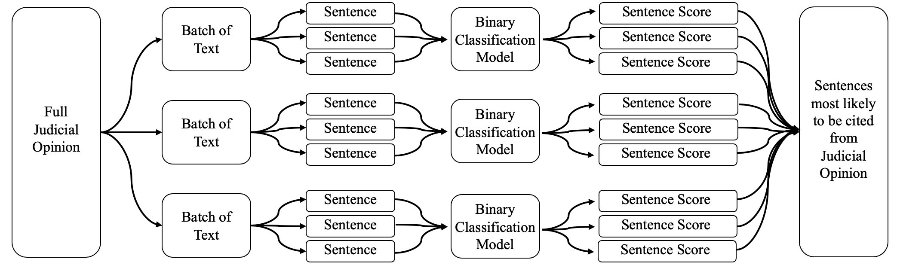

# Using BERT Extractive Summarization to Predict Legal Precedent

The code contained this repository is follows an extractive summarization model for predicting which sentences from judcial opinions are likely to be used as legal precedent.

The overall process is as follows: 

### Important: To properly run this code, you must have the files case_data.jsonl.xz and unique_citations_origin_dict.pickle on your machine which are not yet publically available.

My notebooks are organized in four sections:

1. Sentence Classification Model
2. Batch Classification Model
3. Aggregation
4. Miscellaneous Data Analysis

### 1. Sentence Classification Model

This folder contains the notebooks that preprocesses the judcial opinions to be passed into a BERT model and the notebook that finetunes the BERT model for sentence classification.

The 'sentence_model_preprocessor' file uploads the opinions, splits them into smaller batches, devides the batches into sentences, and labels whether each sentence is a "golden sentence" (whether the sentence was cited in a future opinion).

The 'sentence_model_trainer' file builds a BERT model with adiditonal layers that allow for a sentence and a batch of text to be passed into the model and prediction as to whether that sentence will be cited in the future as the output. The file contains both training and validation.

### 2. Batch Classification Model

This folder contains the preprocessing and finetuning for a model that predicts the probability of a batch of text containing a golden sentence. This prediciton will be used to weight sentence scores when aggregating the scores from batches back together to represent the enture opinion.

The 'batch_model_preprocessor' file builds a training and testing dataframes that contain batches and a label as to wehther a batch contains a golden summary.

The 'batch_model_trainer' file builds a BERT model with additional layers that allows for a batch to be passed in as input and a predcition as to whether that batch contains a golden sentence to be the output. It contains both training and validation.

### 3. Aggregation

This folder containes a preporcessing file that related the sentence scores from batches to the full opinion and an analysis files that looks at the results of aggregating the sentence scores.

The 'aggregation_preprocessor' computes the score resulting from passing the each sentence an batch through our sentence classification model. It then updates those scores with a positional weight and a weight determined by the batch classification model. These scores are stored and sent for analysis. 

The 'aggregation_analysis' file uses the the scores from the different aggregation methods and calculates a golden score comparsion, and top-k analysis and a top-2k analysis to show how well the predcited sentences relate to those that are actually used as legal precedent.

### 4. Miscellaneous Data Analysis</u>

This folder contains one file that was used to calculate random plots or values relating to my data. These values include:

- Calulating the total number of cases in the database
- Visualizing the Metadata included for a case
- Analyzing the number of summaries typically in a case
- Finding where the summaries typcially occur within a case and fitting a curve to it
- Manual Analysis of Training and Testing Accuracies for Sentence Classification Model 
- Finding the Number of Examples used in Training and Testing for Sentence Classification Model
- Manual Analysis of Training and Testing Accuracies for Batch Classification Model 
- Finding the Number of Examples used in Training and Testing for Batch Classification Model

Thanks!
